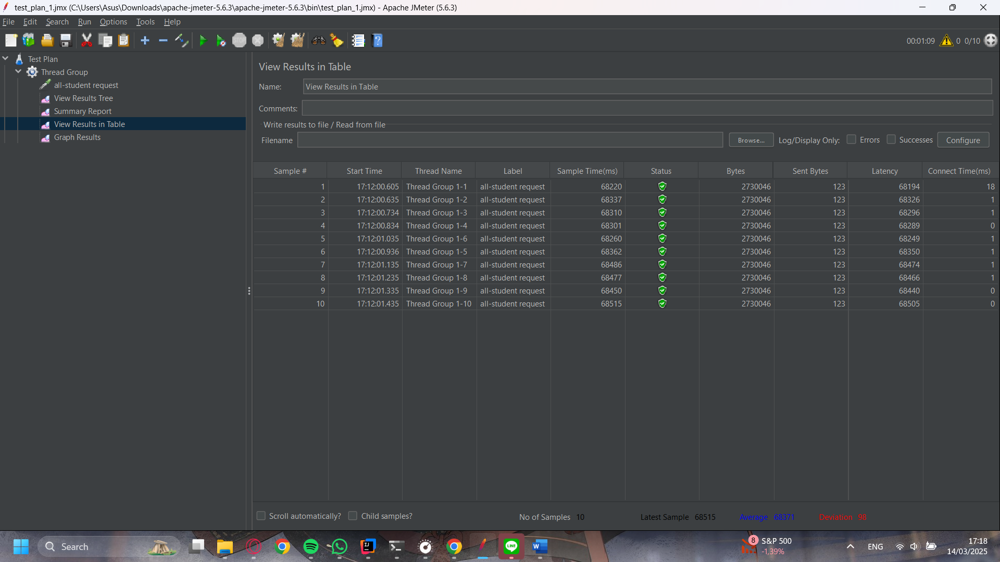
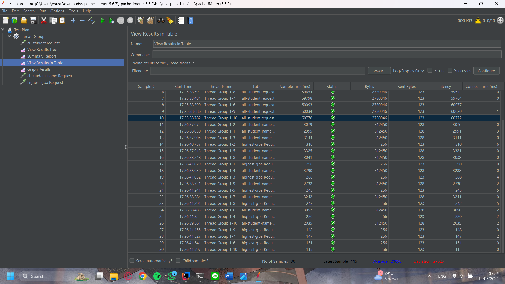
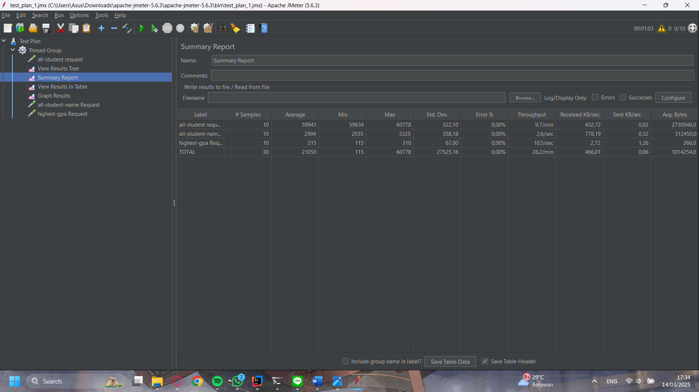
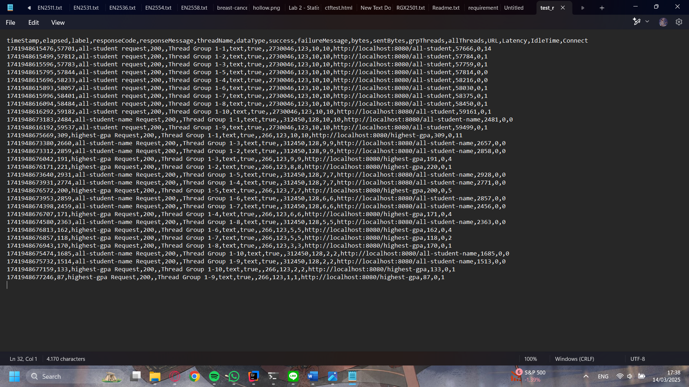

### Performance Test Result

### **Reflection on Performance Testing and Profiling**

#### **1. Difference Between JMeter Performance Testing and IntelliJ Profiling**
JMeter performance testing focuses on simulating real-world user traffic to measure an application's responsiveness, stability, and throughput under load. It provides metrics like response time, throughput, and error rates, which help identify slow endpoints.

On the other hand, IntelliJ Profiler is a **code-level** analysis tool that provides insights into method execution times, CPU consumption, and memory usage. It helps pinpoint inefficient code, memory leaks, and performance bottlenecks within the application.

While JMeter identifies performance issues at a **high level**, profiling with IntelliJ helps in understanding the **root cause** of those issues.

#### **2. How Profiling Helps in Identifying Weak Points**
Profiling allows us to:
- Detect which **methods consume the most resources** (CPU, memory).
- Analyze **method execution time** to see where the application spends the most time.
- Visualize performance using a **flame graph** and **method list**, making it easier to focus on critical optimizations.
- Compare **before and after** optimization results, ensuring our changes improve performance.

#### **3. Effectiveness of IntelliJ Profiler in Identifying Bottlenecks**
IntelliJ Profiler is highly effective because it:
- Provides **real-time insights** into performance at the method level.
- Distinguishes between **total time vs. CPU time**, helping separate actual processing issues from waiting times.
- **Highlights inefficient code sections**, making it easier to refactor and improve.
- Supports **comparison views**, making it easy to validate performance improvements after optimizations.

However, it may not always capture **real-world traffic patterns**, which is why combining it with JMeter testing is essential.

#### **4. Challenges Faced and How to Overcome Them**
- **JVM Warm-up Time:** The first execution often takes longer due to JVM optimizations (JIT compilation). **Solution:** Run the application multiple times before profiling.
- **Database Query Overhead:** Poorly optimized queries can slow down the system. **Solution:** Use **batch processing**, **indexed queries**, and **lazy loading** where appropriate.
- **Thread Contention:** High CPU utilization due to multiple threads competing for resources. **Solution:** Optimize synchronization and use **parallel processing** if necessary.
- **Measuring Impact Accurately:** Differences in profiling and JMeter results can make it hard to validate improvements. **Solution:** Always compare **CPU time** before and after optimization.

#### **5. Benefits of Using IntelliJ Profiler**
- **Pinpoints inefficient code** quickly.
- **Breaks down execution time** into total and CPU time for better analysis.
- **Flame graph visualization** makes bottlenecks easy to identify.
- **Helps in iterative optimization**, ensuring every change improves performance.
- **Provides a granular view** of CPU, memory, and execution time, helping with precise fixes.

#### **6. Handling Inconsistencies Between JMeter and IntelliJ Profiler Results**
- JMeter **simulates real-world traffic**, while IntelliJ Profiler **analyzes internal execution**.
- Differences may arise due to **network latency, database performance, or garbage collection**.
- To align results:
    - Cross-check **high-response-time endpoints in JMeter** with **high-CPU-time methods in IntelliJ**.
    - Run multiple profiling tests to **reduce variability**.
    - Focus on **CPU time**, as it reflects true computational effort.

#### **7. Strategies for Optimizing Application Code & Ensuring Functionality**

##### **1. Reducing Redundant Database Queries**
**Issue:**
- The original `getAllStudentsWithCourses()` method had an **N+1 query problem**, where it fetched students first and then made a separate database call for each student’s courses.
- This resulted in **multiple database hits**, slowing down the system.

**Optimization Strategy:**
- We optimized it by **fetching all student-course relationships in one query** and using a **map** to associate students with their courses efficiently.
- This drastically reduced the number of queries, improving response time.

**Ensuring Functionality:**
- **Validated** that every student is correctly associated with their courses.
- **Performed integration tests** to verify that student-course relationships are correctly fetched after optimization.

##### **2. Using Java Streams for Efficient String Operations**
**Issue:**
- The `joinStudentNames()` method used `+=` for string concatenation, which is inefficient because strings are immutable in Java.

**Optimization Strategy:**
- We replaced it with `Collectors.joining(", ")`, which uses a **StringBuilder internally**, making it more efficient.

**Ensuring Functionality:**
- **Compared the output** before and after optimization to ensure all student names are still correctly concatenated.
- **Edge case testing:** Verified behavior for an empty list, a single student, and multiple students.

##### **3. Using Java Streams to Find the Student with the Highest GPA**
**Issue:**
- The `findStudentWithHighestGpa()` method used a manual loop with an external variable to track the highest GPA.

**Optimization Strategy:**
- We replaced it with `stream().max(Comparator.comparingDouble(Student::getGpa))`, making the code **more readable and optimized** by leveraging built-in stream operations.

**Ensuring Functionality:**
- **Unit tested with multiple cases**, including:
    - A single student scenario.
    - Multiple students with different GPAs.
    - A scenario where multiple students have the highest GPA.
- **Validated the correctness** of the `Optional<Student>` return type.

##### **How We Ensure Changes Don’t Affect Functionality**
1. **Unit Testing & Integration Testing**
    - We wrote test cases to compare the **before and after** results of each optimized method.
    - Ensured the data retrieved remained accurate while improving performance.

2. **Database Verification**
    - Checked SQL queries before and after optimization using **query logs** to ensure no unexpected behavior occurred.

3. **Profiling Before & After Optimization**
    - Used IntelliJ Profiler to verify that CPU time **decreased by at least 20%** while maintaining correctness.

4. **JMeter Performance Testing**
    - Re-ran the performance tests to confirm the response times improved after optimizations.
